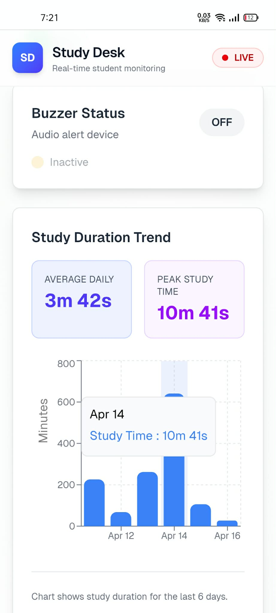

# StudyGuard — An IoT & AI-Powered Smart Desk Monitor

> A zero-interaction system that knows when you are at your desk, when you are actually focusing, and when you need a break.

## Introduction

StudyGuard started with a simple frustration: study timers lie. We press start, get distracted, fall asleep, and the timer keeps running.

This project combines a small ESP32 board with a laptop camera to build an honest study companion. The hardware senses if you are physically present. The AI watches if your eyes are open and focused. Firebase connects the two in real time. The result is an automated light, an automatic timer, and a real Focus Score.

I built it for students in dorm rooms and remote workers who want data, not guilt, about their study habits.

## Problem

After testing normal apps for a week, three problems became clear:

1.  **Manual timers fail.** We forget to start them, and we definitely forget to stop them.
2.  **Apps track screens, not people.** You can be away from your desk for 20 minutes and your phone still counts it as study time.
3.  **Fatigue is invisible.** No app warns you when you are micro-sleeping over your notes. You only notice after you have wasted an hour.

The gap is between "time at desk" and "time actually learning." Existing IoT lamps solve lighting but have no memory. Existing productivity apps have memory but have no eyes.

## Demo

The setup is simple: an ESP32 with ultrasonic sensor sits on the desk, the LED lights up automatically when you sit, and the laptop runs MediaPipe to track eye closure in real time.

| Hardware Output | Software Output |
|:---------------:|:---------------:|
|  |  |
| *This figure shows the physical hardware setup and real-time operation of the system.* | *This figure demonstrates the software-side detection and processing results.* |

 

| Web Dashboard |
|:-------------:|
|  |
| *This figure presents the web-based dashboard used for monitoring and visualization.* |

## Solution Approach

We did not want another app to manage. We wanted something that works without touching it.

### How it works

**1. Presence Detection (Hardware)**

- ESP32 + HC-SR04 ultrasonic sensor under the desk
- If distance < 10 cm for more than 10 seconds, you are marked "present"
- The 10-second debounce is key. It stops the timer from flickering when you just lean back to think

**2. Focus Detection (AI)**

- Python + OpenCV + MediaPipe Face Mesh on your laptop
- We calculate Eye Aspect Ratio (EAR) from 6 eye landmarks
- EAR = (||p2-p6|| + ||p3-p5||) / (2 \* ||p1-p4||)
- If EAR < 0.22 for > 3 seconds, system triggers drowsiness alert

**3. The Bridge**

- Firebase Realtime Database holds the state: `present`, `studying`, `drowsy`
- ESP32 listens to Firebase. When `drowsy` becomes true, buzzer beeps. When `present` is true, LED turns on.

**4. The Metric**

- Focus% = min(100, T_study / T_desk \* 100)
- This is the analysis part. Most students discover their Focus% is 60-70% on the first day. That honesty is what changes behavior.

### Tech Stack

- **Firmware:** Arduino C++, Firebase_ESP_Client
- **AI Engine:** Python 3.10, MediaPipe, OpenCV
- **Backend:** Firebase RTDB
- **Hardware:** ESP32-WROOM-32, HC-SR04, LED, buzzer

### Why this design

- Offloading vision to the laptop keeps the ESP32 cheap and low power (~160 mA)
- Using Firebase instead of MQTT gives us <50 ms latency and free logging
- Zero-interaction was non-negotiable. If you have to press a button, you will stop using it in three days.

## Conclusion

StudyGuard works because it does not ask for discipline, it measures it. In testing, the system ran reliably in low light, ignored small movements, and gave an immediate alert before a full microsleep.

It is not perfect. You still need a laptop for the camera, and the EAR threshold needs a one-time calibration per user. But for less than the price of a textbook, you get an objective mirror for your study habits.

**Future plans:** mobile dashboard, posture detection with MediaPipe Pose, and moving the model to an ESP32-S3 with camera to remove the laptop.

---

If you build this, start with the hardware loop first. Get the ultrasonic sensor talking to Firebase. Then add the Python script. The moment your desk light turns on by itself when you sit down, you will get it.
